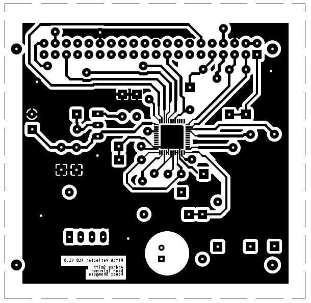
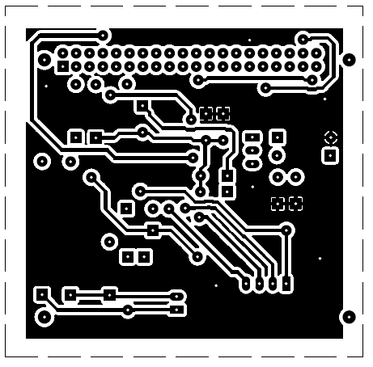
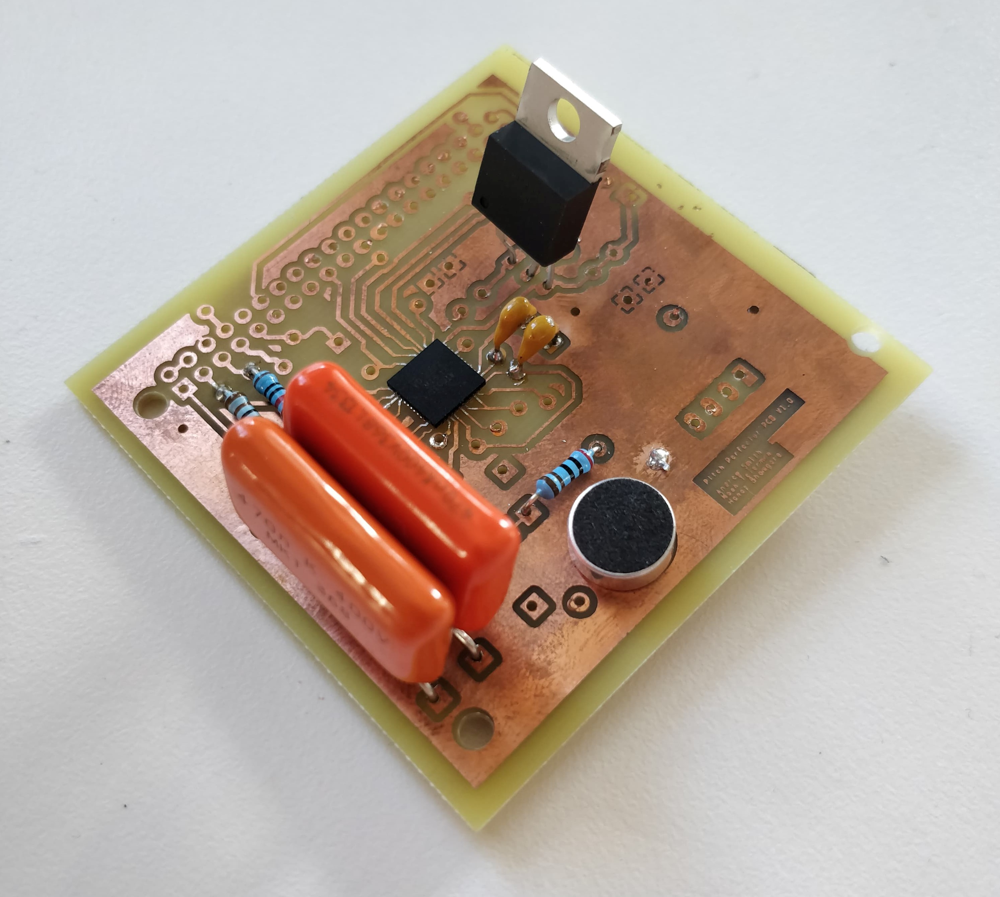
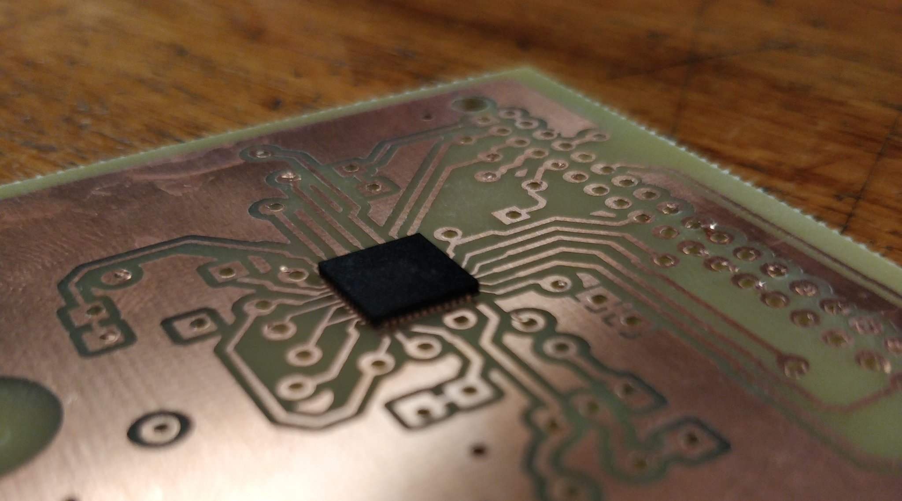
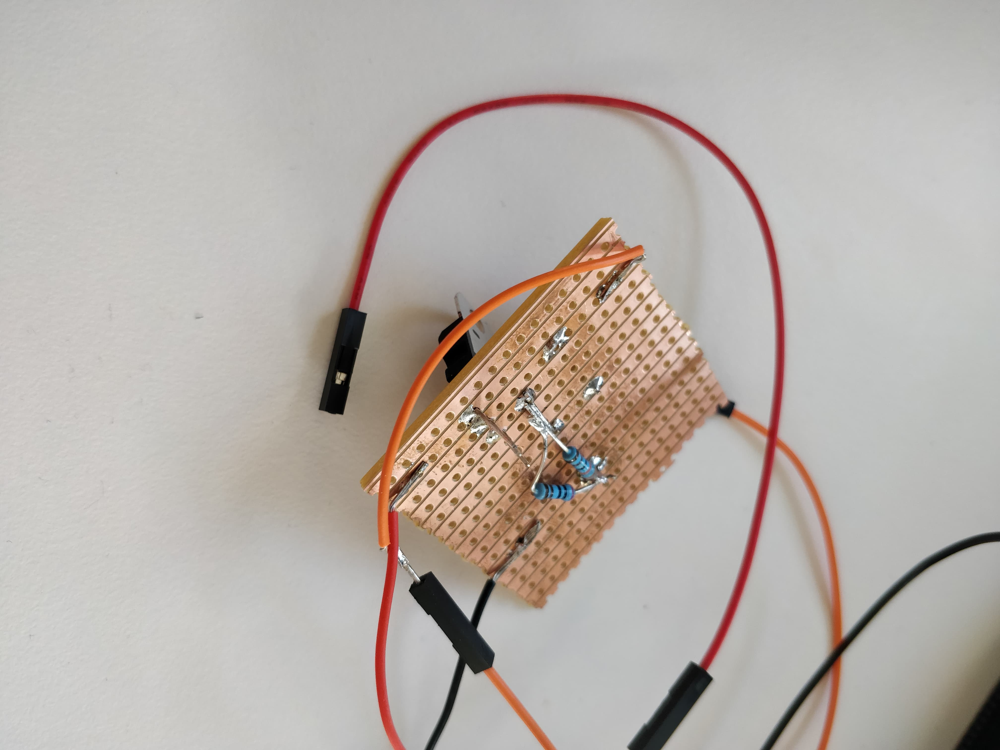

# Hardware

As part of this project an Audio Codec PCB was designed. Unfortunately, due to unforseen circumstances (COVID-19), the fabrication process was interrupted. The PCB which was designed will be discussed below alongside some images. The alternative, non-custom, hardware which was adopted by the project is also described below.

## PCB Design

A single PCB was designed for this project. The function of this PCB was to take the audio input in through an ECM microphone. This audio input would then be input to the Audio codec through an RC input stage using audio-friendly polyester capacitors. The codec would then perform ADC and I2S conversion. This data would then be provided to the Raspberry Pi through the Pi header. This data would be input to the project software which would perform frequency analysis and phase vocoding of the sample. The sample would then be output to the codec through the two-way I2S bus/interface. The codec would perform DAC and output the modified audio signal to a standard auxiliary connector for playback.

The top and bottom traces of the PCB, which were used to print the board, is shown in the images above (top layout) and below (bottom layout). The PCB was designed using Cadence OrCAD and PCB Editor. Although a PCB was printed before it was necessary to work from home, unfortunately there was a scaling error in the printing process which meant that PCB footprints were slightly too small for the components. This was a problem for the Pi header as well as the codec. The scaling issue was rectified and the PCB was resubmitted. Unfortunately, the PCB was in the queue for printing when the problem suddenly hit the university and so was never fully constructed.

The PCB which was printed (with a scaling problem) is shown below with some example components added. This board was used as a practice for soldering before the reprinted version was ready. 

### Codec Choice

The codec integrated into the hardware for the project is the TLV320AIC33 from Texas Instruments (http://www.ti.com/product/TLV320AIC33). The 128 registers of the codec are configurable through I2C which can be provided by the Raspberry Pi. The codec is able to perform the ADC, DAC and I2S interfacing required for the project. The codec supports datarates of up to 96kHz in one direction. The requirement set out for this project was 44.1kHz and this can be handled in a duplex fashion by the codec interface. The ADC stage is characterised by a high signal to noise ratio (92dBA).

### Choice of Components

As well as the codec described above, components were carefully selected in order to perform the required functions of the PCB. Polyester capacitors were used in the audio signal path and multi-layer capacitors were adopted for supply decoupling.

An ECM was chosen for audio input into the system for increased sensitivity. The microphone chosen can be seen in the image below and can be found at https://www.mouser.co.uk/ProductDetail/Kobitone/254-ECM970-RO?qs=jJIL5Dlg2FuYhvXcWEAWIw%3D%3D. This microphone can be seen at the bottom of the picture of the physical PCB above.

A transformer was required to reduce the 3.3V supplied by the Raspberry Pi, which also powers the codec, to ~1.9V for the digital core of the codec. A variable transformer from the store was used in order to do this. The output voltage depends on the choice of resistors placed at the output and adjust pins. The transformer was tested on some prototype board, this test can be seen in the image below. It was wired into the Raspberry Pi and the output voltage was measured using a multimeter and the resistor values were fine-tuned by reducing the adjust pin resistance by adding extra resistors until the correct voltage was output.

## Adafruit MEMS Breakout Board

As a backup option, and for some initial testing, an Adafruit MEMS microphone breakout-board was aquired. This breakout-board/microphone can be seen in the image below. Following problems with the fabrication and construction of the project's custom PCB, this microphone was to become the hardware for the project. This decision was approved by the project supervisors. 

The image above shows the I2S microphone connected up to the corresponding I2S configured pins on the Raspberry Pi. Below, some test sampling, using the MEMS microphone, can be seen.

