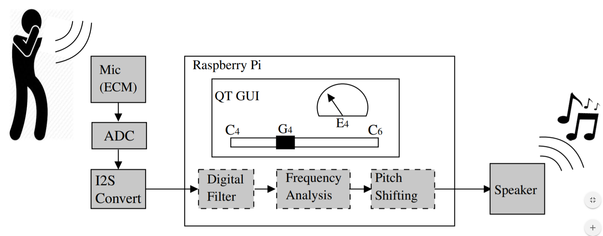

# Pitch Perfector
A microphone application which performs real-time pitch shifting

## System Diagram

The **ECM microphone** converts the vocal (from ~100Hz up to ~3.5kHz) input into an analoge signal  
  
The **ADC** converts this to a digital signal of _____ resolution 
  
The **I2S module** converts this to I2S format which is understood by the Raspberry Pi with a datarate of ______   
  
**Digital filtering** is then performed on the input using _____  
  
**Frequency analysis** is performed by applying a _____ fourier transform and the base frequency is determined  
  
**Pitch shifting** then shifts the frequency components of the signal so they match the note input by the GUI or to a predetermined scale value  
  
This new shifted value is then output to a **speaker**  
