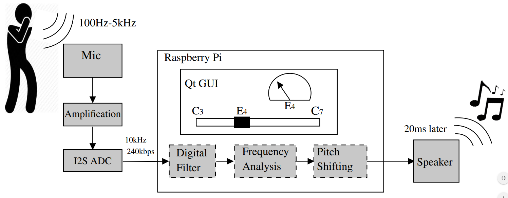

A Raspberry Pi real-time pitch-shifting microphone project.
Stay Tuned...

## System Overview

The **MEMS microphone** converts the vocal (from ~100Hz up to ~3.5kHz) input into an analoge signal  
  
The **I2S ADC** in the Adafruit microphone converts this audio to I2S format which is understood by the Raspberry Pi with a datarate of 240kbps   
  
**Digital filtering** is then performed on the input using an IIR filter implemented in C++  
  
**Frequency analysis** is performed by applying a fourier transform and identifying the base frequency    
  
**Pitch shifting** then shifts the frequency components of the signal using phase vocoding so they match the note input by the GUI or to a predetermined scale value  
  
This new shifted value is then output to a **speaker** 

For more information, see the project [Wiki](https://github.com/a2198699s/pitch-perfector/wiki)

For code documentation, see the [Doxygen documentation](https://a2198699s.github.io/pitch-perfector/html/index.html) published on every commit 

## Licence

For licencing information see [Licence](https://github.com/a2198699s/pitch-perfector/blob/master/LICENSE)

